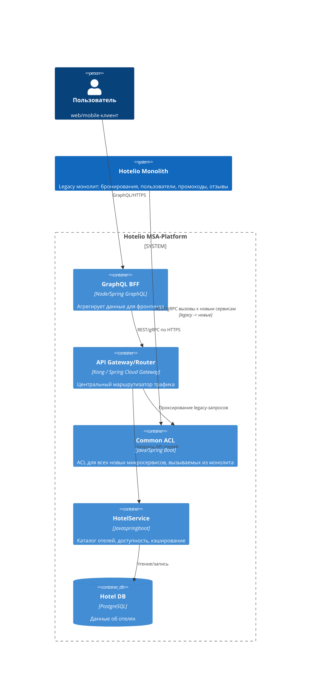
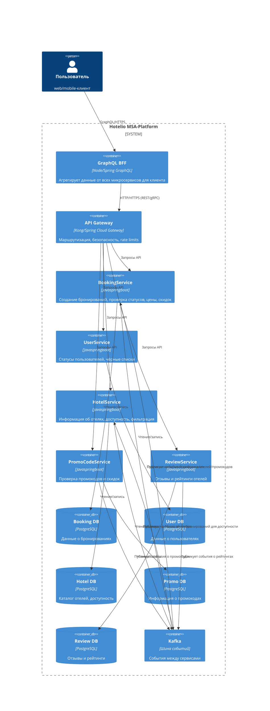

### **Название задачи: переход на микросервисную архитектуру монолита Hotelio** 
### **Автор: Серов Глеб**
### **Дата: 24.08.2025**
### **Функциональные требования**

|**№**|**Действующие лица или системы**|**Use Case**|**Описание**|
| :-: | :- | :- | :- |
| UC1 | Пользователь | Просмотр отзывов об отеле | Пользователь переходит на страницу отзывов отеля. Просматривает список отзывов. |
| UC2 | Пользователь | Просмотр доверенных отелей | Пользователь делает запрос в сервис отзывов по отелю. Сервис по критериям определяет доверенный отель или нет |
| UC3 | Пользователь | Бронирование номера в выбранном отеле | Пользователь делает запрос в сервис на бронирование отеля. Сервис валидирует пользователя и отель, подсчитывает базовую цену и цену по промокоду при наличии, создает бронирование |
| UC4 | Пользователь | Использование промокодов | Пользователь вводит промокод при бронировании. Сервис валидирует ищет промокод в БД, валидирует его и применяет скидку если все успешно |
| UC5 | Пользователь | Получение деталей об отелях | Пользователь делает запрос в сервис на получение списка отелей. Пользователь применяет фильтры. Пользователь запрашивает подробную информацию об отеле, сервис возвращает информацию об отеле |

### **Нефункциональные требования**

|**№**|**Требование**|
| :-: | :- |
| 1 | Масштабируемость: микросервисы должны масштабироваться независимо друг от друга, с возможностью горизонатльного и вертикального масштабирования |
| 2 | Отказоустойчивость БД и изоляция сервисов: каждая БД для сервиса должна работать независимо друг от друга с реплекацией и бэкапами |
| 3 | Надежная очередь сообщений: Kafka должна поддерживать гарантированную доставку сообщений и надежную обработку пиковых нагрузок |
| 4 | Произоводительность: минимальная задержка при поиске и бронировании, оптимизации запросов к БД |
| 5 | Развертывание CI/CD: сервисы должны иметь отдельные CI/CD пайплайны, позвояющие автоматическое тестирование, сборку, деплой и откаты |

### **Решение**

* Были проанализированы основные проблемы монолитной системы. В одном сервисе - BookingService - сосредоточены проверки пользователя отеля, промокодов, отзывов - все это без четких границ ответственности. При изменении контрактов в сервисе могут возникнуть проблемы с интеграцией других сервисов. Также это требует глубокого понимания взаимодействия между сервисами. Также имеется проблема наличия одной единой БД для всех сервисов, что затрудняет масштабирование отдельных частей. Отстутсвует абстракция для изоляции сервисов. Каждое бронирование тянет за собой цепь зависимостей, что увеличивает латентность и точку отказа. Также имеется ограниченный API для фронтенда, которые возвращают все сразу.

* За основу миграции на микросервисную архитектуру был взят паттерн Strangler Fig. Первым шагом принято решение вынести HotelService в отедльный микросервис со своей БД и кэшем. Данный сервис был выбран из-за того, что у него низкая связность с другими компонентами монолита, не управляет сложной бизнес-логикой транзакций. Развертка данного микросервиса будет происходить рядом с монолитом через ACL. ACL в дальнейшем будет использоваться для коммуникации новых микросервисов с монолитом.

* Диграмма ниже приведена в виде C4 и показывает первый вынос микросервиса HotelService в отедльный микросервис со своей БД и его связи с монолитом.

* В конечном счете, после финального перехода на микросервисную архитектуру, слой ACL будет убираться, и получится диаграмма ниже:

* Обоснование решения:
    - Миграция происходит по паттерну Stragler Fig, которая позволяет постепенно выводить функционал из монолита, минимизируя риски для работающего монолита
    - CI/CD на сервис - отдельные пайплайны, автотесты, сборка, деплои, откаты (канареечные/blue-green)
    - Использование ACL изолируют монолит, проксирует легаси-вызовы в новые сервисы, поддерживает мягкую миграцию
    - Доменные микросервисы снижают связанность и позволяют проводить независимую разработку
    - Kafka позволяет обеспечить гарантированную доставку и надежную обработку пиковых нагрузок

### **Альтернативы**
1. Миграция по типу большого взрыва. Могут возникнуть риски отказа системы, поломки функциональности, повышается технический долг, застой в разработке нового функционала приложения.
2. Выделение первого сервиса - ReviewService. Выделение этого сервиса повлечет за собой аналогичные риски как и с выделением HotelService, разница будет небольшая, т.к. зависимости у данного сервиса не большие.

**Недостатки, ограничения, риски**

1. Дополнительный слой ACL повышает сложность системы и время отклика. Но это временное решение, т.к. после перехода на микросервисную архитектуру слой ACL будет убираться
2. Усложненная трассировка из-за большего количества хопов между клиентом и БД
3. Повышается нагрузка на команду разработчиков/devops
4. Повышается сложность тестирования нового функционала

### План миграции
1. Выделение первого сервиса - HotelService
    - Создание ACL
    - Перенос HotelController/HotelService/HotelRepository в микросервис и создание автономной БД
    - Настройка API Gateway
2. Пошаговое отключение легаси-функционала из монолита
3. Циклическое повторение для Review/Promocode/AppUser сервисов
4. Перенос "тяжелого" сервиса BookingService в микросервис
5. Постепенное отключение монолита, удаление ACL